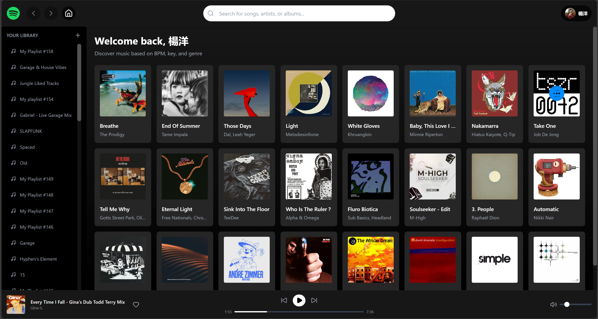
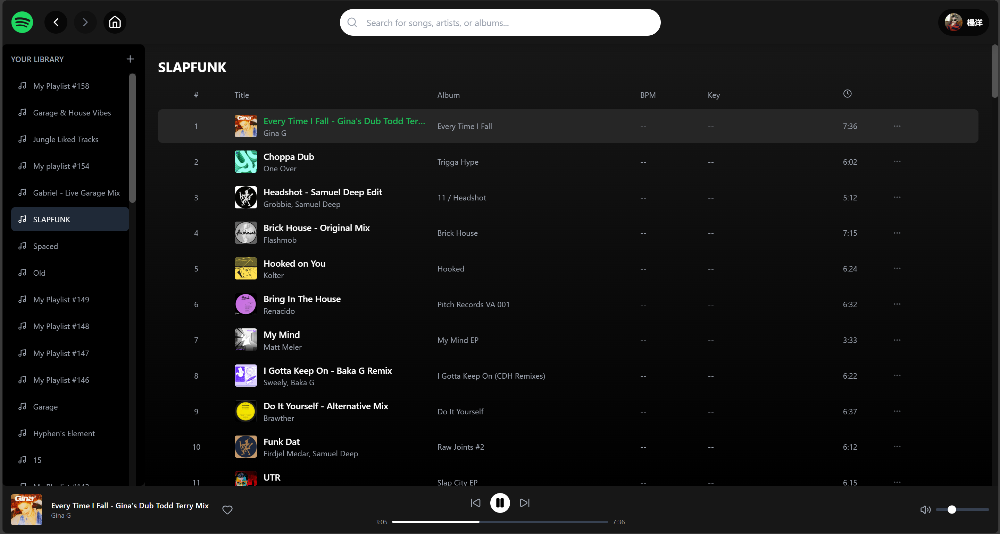
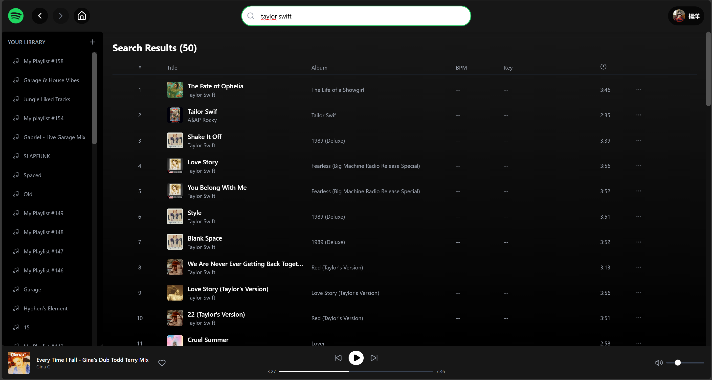
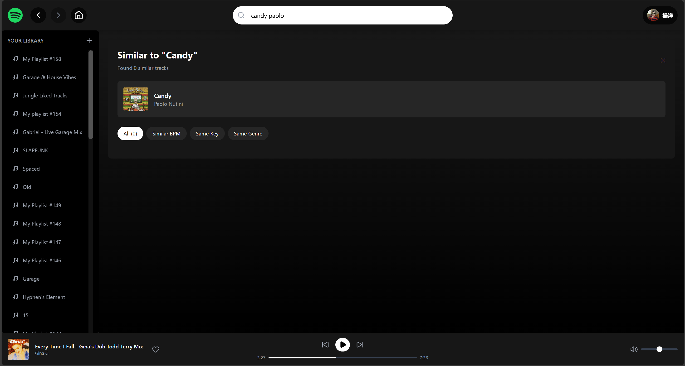

# Spotify Music Discovery

This is a single page frontend web application that integrates Spotify's Web API, Playback SDK and Reccobeats API to discover similar songs based of audio features like key and bpm.

## Important Notes

- This project is still under development - it is not finished

- Spotify has deprecated their Audio Features, Audio Analysis, and Recommendations API endpoints. This app used those endpoints now making the recommendation feature broken. I am currently trying to find workarounds with different APIs.

- Spotify Premium is required for the Web Playback SDK to function. Free tier users can browse and search but cannot play music within the app.

## Features

- Spotify Integration - Full authentication and playback control

- Smart Search - Search for songs, artists, and albums

- Similar Track Discovery - Find similar songs based on artist and metadata

- Audio Features Display - View estimated BPM, key, and energy levels

- Web Playback - Play music directly in your browser

- Playlist Management - Browse and play your Spotify playlists

- Spotify-Inspired UI - Clean, modern interface matching Spotify's design language

## Preview


**Home Page**



**Playlists**



**Search**



**Similar tracks** (working on a solution)

## Tech Stack

- Frontend: React 18 + Vite
- Styling: Tailwind CSS
- Icons: Lucide React
- Routing: React Router DOM
- APIs:
    - Spotify Web API
    - Spotify Web Playback SDK
    - Reccobeats API

- State Management: React Context API


## Prerequisites
- Node.js v16 or higher
- npm
- Spotify Developer acoount
- Spotify Premium account (for music playback)

## Installation
1. Create Spotify Developer account

    1. Go to https://developer.spotify.com/dashboard and sign into your Spotify account

    2. Click create app
        - can put anything for name or description
    3. Set Redirect URL to
        ```
        http://127.0.0.1:5173/callback
        ```
    4. Select Web API and Web Playback SDK

    5. Copy your Client ID (you'll need this later)

2. Clone the repo
 
```
git clone https://github.com/bertie-simmons/Spotify-DJ-web-client.git

cd Spotify-DJ-web-client
```

3. Install dependencies
```
npm install
```
4. Create Environment Variables

    create a **.env** file in your root directory and add the following configurations

```
VITE_SPOTIFY_CLIENT_ID= (paste your client id here from step 1)
VITE_SPOTIFY_REDIRECT_URI=http://127.0.0.1:5173/callback
```
5. Start Development Server
```
npm run dev
```
6. Go to http://127.0.0.1:5173 on your browser

### Acknowledgments

- Spotify Web API
- Spotify Web Playback SDK
- Design inspired by Spotify's interface